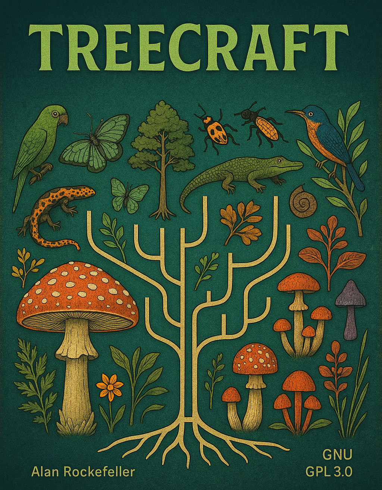

# TreeCraft

A cross-platform phylogenetic tree visualization and analysis tool.   The goal of this program is a way to quickly generate and modify phylogenetic trees without having to edit lots of FASTA files manually.

Version 1.0

By Alan Rockefeller - 4/21/2025



## What is TreeCraft?

TreeCraft helps you create, visualize, and analyze phylogenetic trees from DNA sequence data. It combines powerful tree-building algorithms with an easy-to-use interface.

## Features

### Sequence Handling
- Import sequences from FASTA/FASTQ files with automatic validation
- Fix common sequence formatting issues automatically
- Edit sequence names directly within the application
- Align sequences using integrated alignment tools

### Tree Building
- Build trees using multiple methods:
  - Quick methods: UPGMA, Neighbor Joining
  - Advanced methods: Maximum Likelihood (RAxML)
- Assess tree reliability with bootstrap support
- Find the best evolutionary model for your data using ModelTest-NG or IQ-TREE

### Visualization
- Interactive tree display with drag-and-drop rearrangement
- Customize tree appearance (branch widths, colors, fonts)
- Highlight important branches or taxonomic groups
- View aligned sequences alongside the tree
- Easily remove branches from the tree
- Toggle between dark and light mode

### Export & Sharing
- Save trees in standard formats (Newick, Nexus, PhyloXML)
- Export tree visualizations as high-quality images (PNG, JPG, SVG)
- Export alignments for use in other applications

## How TreeCraft Works

1. **Load your sequences** - Import your DNA/RNA sequences from FASTA or FASTQ files
2. **Align your sequences** - Use integrated alignment tools (MUSCLE, MAFFT) or import pre-aligned data
3. **Build your tree** - Choose from multiple tree-building algorithms with customizable parameters
4. **Visualize and edit** - Interact with your tree, customize its appearance, and make adjustments
5. **Export and share** - Save your tree in various formats for publication or further analysis

## External Tool Integration

TreeCraft integrates with popular bioinformatics tools:

- **Alignment**: MUSCLE, MAFFT
- **Alignment trimming**: trimAl, Gblocks
- **Model testing**: ModelTest-NG, IQ-TREE
- **Tree inference**: RAxML/RAxML-NG, MrBayes

Note: These tools are optional - TreeCraft will use them if available but provides built-in alternatives.

## Installation

1. Clone this repository
2. Install the required dependencies:
   ```
   pip install PyQt6 biopython matplotlib numpy
   ```
3. Optionally install RaxML, IQ-Tree and ModelTest-NG   
4. Run TreeCraft:
   ```
   ./run_treecraft.sh
   ```
   or
   ```
   python3 treecraft.py
   ```

## Directory Structure

- `treecraft/gui/`: GUI components (windows, dialogs, visualization)
- `treecraft/core/`: Core functionality (tree building, file handling)
- `treecraft/utils/`: Utility functions (external tool integration)

## Development

If you find any bugs or have suggestions contact Alan Rockefeller, or make the changes yourself and do a pull request.

https://github.com/AlanRockefeller/Treecraft

## License

GNU General Public License 3.0
